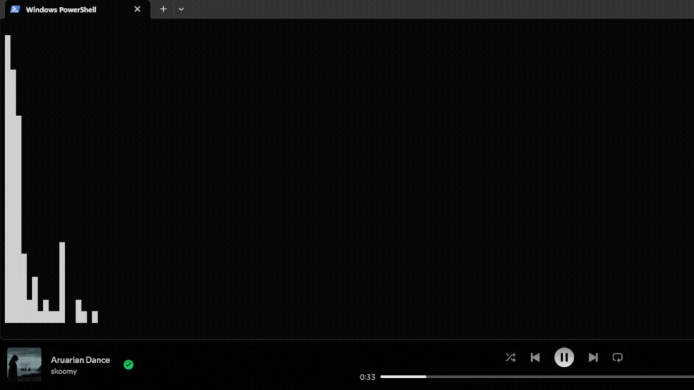

# >_ Terminal Audio Visualizer 

A real-time terminal audio visualizer using Python, NumPy, and Soundcard.  
Displays audio FFT as vertical bars in your terminal.
<div style="display:flex">


</div>

## Requirements
- Python 3.9+
- numpy
- soundcard

## Usage
```bash
git clone https://github.com/A56-A5/terminal-audio-visualizer
cd terminal-audio-visualizer
pip install -r requirements.txt
py visualizer.py
``` 